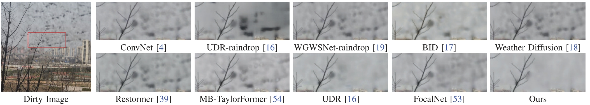
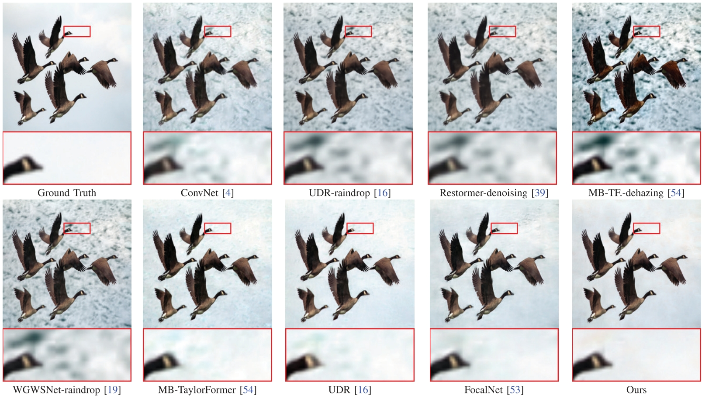

# ReDNet: Restoration of Images Taken Through a Dirty Window Using Optics-guided Transformer

[](https://ieeexplore.ieee.org/abstract/document/11021506) [](https://huggingface.co/MMQDD/ReDNet) [](LICENSE)

## Abstract

Taking photographs through windows is an inevitable scenario in the real world, but glass windows are not ideally clean in most cases. Although there exist various raindrop removal methods, the occlusion of dirt, as another dirty window case, has not been well valued. The vital reasons include *i)* the limitation of the optical imaging model proposed in previous methods, and *ii)* the shortage of a practical dataset for sufficient types of dirty glass windows. To fill this research gap, in this paper, we first propose a general optical imaging model that fits widely used dirty window cases. Following this, training and testing synthetic datasets are generated, and real-world dirty window data are collected to evaluate the effectiveness of our imaging model and synthetic data. For the methodology part, we propose an optics-guided Transformer network to solve this special image restoration problem, i.e., the dirt removal for images taken through a dirty window. Experimental results demonstrate that our imaging model is effective and robust. Our proposed network leads to higher performance than existing methods on both synthetic and real-world dirty window images.

## Contents
1. [Visual Results](#visual-results)
2. [Installation](#installation)
3. [Pretrained Weights](#pretrained-weights)
4. [Quick Start (Demo)](#quick-start-demo)
5. [Benchmark Evaluation](#benchmark-evaluation)
6. [Training](#training)
7. [Dataset Preparation](#dataset-preparation)
8. [Notes on Metrics](#notes-on-metrics)
9. [Limitations](#limitations)
10. [Disclaimer](#disclaimer)
11. [Citation](#citation)
12. [Acknowledgments](#acknowledgments)
13. [License](#license)

## Visual Results

**Real-world dirty window photograph** (from the paired benchmark; left: dirty input, middle: ReDNet, right: ground truth; bottom: zoomed crops):

<p align="center">
  
</p>

**Synthetic example** (left: dirty input, middle: ReDNet, right: ground truth):

<p align="center">
  
</p>

ReDNet handles dirt of various shapes, densities, blur levels, and color statistics — note that dirt appears dark against bright backgrounds and bright against dark backgrounds. More comparisons can be found in the paper.

## Installation

```bash
git clone https://github.com/Zongliang-Wu/ReDNet.git
cd ReDNet
pip install -r requirements.txt
```

Requirements: Python ≥ 3.8, PyTorch ≥ 1.11 (tested with 1.11 / 2.4), torchvision, einops, opencv-python, scikit-image. LPIPS evaluation additionally needs `pip install lpips`.

## Pretrained Weights

All weights are hosted on [](https://huggingface.co/MMQDD/ReDNet) (this repository contains no model files). Download and place them as:

```
ReDNet/
└── pretrained/
    ├── rednet_dirt.pth        # main model: synthetic benchmark (Tab. III) + qualitative results
    ├── rednet_dirt_real.pth   # real-world paired benchmark (Tab. IV) checkpoint of the same run
    ├── restormer_dirt.pth     # Restormer baseline trained on the same data (optional)
    └── lpips_vgg.pth          # LPIPS linear weights used by the training loss (taming-transformers vgg.pth)
```

`rednet_dirt.pth` and `rednet_dirt_real.pth` are two checkpoints (276k / 164k iterations) of the same training run; check the SHA256 checksums in `pretrained/SHA256.txt` after download.

## Quick Start (Demo)

Restore a single image, a folder, or a very large photo (12 MP+) with block-wise processing:

```bash
python demo.py --weights pretrained/rednet_dirt.pth --input dirty.jpg --output_dir results
python demo.py --weights pretrained/rednet_dirt.pth --input ./my_photos --output_dir results
python demo.py --weights pretrained/rednet_dirt.pth --input huge_12mp.jpg --output_dir results --blockwise
```

## Benchmark Evaluation


### Synthetic test set (Tab. III of the paper)

100 synthetic 256×256 dirty/GT pairs (see [Dataset Preparation](#dataset-preparation)). The evaluation follows the paper convention (SSIM with `data_range=2`, images normalized by their own maximum — see [`rednet/utils.py`](rednet/utils.py); pass `--standard_ssim` for the modern convention):

```bash
python tools/test_synthetic.py \
    --weights pretrained/rednet_dirt.pth \
    --dirty_dir datasets/syn_test/dirty \
    --gt_dir datasets/syn_test/gt \
    --save_dir results/syn --save_images
```

### Real-world paired test set (Tab. IV of the paper)

3 real dirty/GT pairs (`1`, `9`, `checker_far`, 1200×900):

```bash
python tools/test_real.py --mode fr \
    --weights pretrained/rednet_dirt_real.pth \
    --dirty_dir datasets/real_test/paired/dirty \
    --gt_dir datasets/real_test/paired/gt \
    --save_dir results/real_fr
```

### Real-world no-reference set (67 images)

```bash
python tools/test_real.py --mode nr \
    --weights pretrained/rednet_dirt.pth \
    --dirty_dir datasets/real_test/noref \
    --save_dir results/real_nr
```

## Training


```bash
torchrun --nproc_per_node=2 --master_port=4321 train.py -opt options/train_rednet.yml --launcher pytorch

```


## Dataset Preparation

### Synthetic data (training / Tab. III)

The synthetic set is generated from the dirty-window imaging model with clean images from [DIV2K](https://data.vision.ee.ethz.ch/cvl/DIV2K/) and [Flickr2K](https://cv.snu.ac.kr/research/Flickr2K/) (see [`synthesis/`](synthesis/README.md)):

- 4000 training patches and 100 test patches of 256×256, each a (dirty, clean, dirt-mask) triplet;
- attenuation and scattering factors are sampled uniformly at random; the inside illumination is a random color;
- dirt patterns come from Gu et al. (2007) (`dirt` / `dust` / `lipids` and their mixtures) plus self-collected patterns (whiteboard capture → color conversion, vignetting, inversion, cropping, resizing, Gaussian blur).

**Licensing note.** DIV2K and Flickr2K are released for academic research only and are collected from Flickr; their terms do not permit redistribution of the images or of derived copies (citing them is not a substitute for a license). Accordingly:

- Obtain them from the official links above.
- The derived training triplets are distributed via the [Hugging Face repo](https://huggingface.co/MMQDD/ReDNet) as a **gated dataset for academic research only** (`datasets/train`, with `MANIFEST.csv` for integrity checking). If you cannot accept these terms, please do not use them.
- The data synthesis pipeline is available in [`synthesis/`](synthesis/README.md) together with the dirt-pattern library (`datasets/dirt_patterns_256`, 3962 train + 815 test patterns), so the training data can also be regenerated locally from officially downloaded DIV2K/Flickr2K images.

Expected folder layout:

```
datasets/
├── train/           # 4000 triplets (gated HF distribution, academic use)
│   ├── gt/  dirty/  mask/  MANIFEST.csv
├── syn_test/        # 100 triplets (same license terms as train)
│   ├── gt/  dirty/  mask/
└── real_test/
    ├── paired/      # 3 real pairs (dirty + gt, 1200x900) - captured by the authors
    │   ├── dirty/  gt/
    └── noref/       # 67 real dirty images (45 self-captured + 22 collected from
                     # the web for academic benchmarking; contact us for removal)
```

### Real-world benchmark

The 3 paired and 67 no-reference real images are released in the same [Hugging Face repo](https://huggingface.co/MMQDD/ReDNet) (`datasets/real_test`). Each pair was captured by photographing through a dirty window, then cleaning the window and re-photographing with identical position and camera settings (10 shots averaged per step); images are cropped to the region of interest and resized to 1200×900. The paired benchmark uses images `1`, `9` and `checker_far`.

## Notes on Metrics

- Full-reference metrics are computed on RGB images saved as PNG, with LPIPS (AlexNet) on saved files.
- Measured values may deviate slightly across library versions (PyTorch, scikit-image, lpips); use the pinned environment if exact reproduction is required.

## Limitations

ReDNet addresses a specific degradation — dirt accumulated on window glass — and has known boundaries, following Sec. VII of the paper:

- **Dependence on the training pattern distribution.** The model relies on dirt patterns that exist in, or are close to, the training data. Since dirt patterns are uncountable and cannot be enumerated, some out-of-distribution dirt may not be well removed, although ReDNet still compares favorably against existing methods.
- **Scope of the imaging model.** Specular reflection from the glass is explicitly ignored (Sec. III-A); images dominated by strong reflections are out of scope. Scenes where dirt is imperceptible (extremely defocused or too sparse) are also not targeted.
- **Not a universal restoration model.** Other degradations such as rain streaks, haze, or general noise are not the goal of the released checkpoints; a unified model handling multiple adverse conditions remains future work.

## Disclaimer

- This project is provided **for academic research purposes**. The code is under the MIT License, but the pretrained weights, the synthetic data and the real-world benchmark carry their own terms (see [License](#license)).
- The software and data are provided **"as is", without warranty of any kind**; the authors take no responsibility for outcomes produced with them.
- Real-world no-reference benchmark images partly come from the web and are kept strictly for academic benchmarking; copyright holders may request removal.
- Commercial use of the weights or the datasets requires prior permission from the authors.

## Citation

If you find this work useful, please cite:

```bibtex
@article{wu2025restoration,
  title={Restoration of Images Taken Through a Dirty Window Using Optics-guided Transformer},
  author={Wu, Zongliang and Zhang, Juzheng and Fu, Ying and Zhang, Yulun and Yuan, Xin},
  journal={IEEE Transactions on Image Processing},
  volume={34},
  pages={3352--3365},
  year={2025},
  publisher={IEEE},
  doi={10.1109/TIP.2025.3573500}
}
```

## Acknowledgments

This repository is built on top of [Restormer](https://github.com/swz30/Restormer). Some of dirt patterns from Gu et al. (2007), *Dirty Glass: Rendering Contamination on Transparent Surfaces*, are used for synthetic data generation. Clean training images are from [DIV2K](https://data.vision.ee.ethz.ch/cvl/DIV2K/) and [Flickr2K](https://cv.snu.ac.kr/research/Flickr2K/). We thank all the authors for releasing their code and data.

## License

- Code: [MIT License](LICENSE).
- Pretrained weights are released for academic research use. If you use them in a commercial product, please contact the authors.
- Real-world benchmark images: captured by the authors (45 self-captured) or collected from the web (22 images, kept for academic benchmarking); ***please contact us if you are a copyright holder and want an image removed***.
- Dirt-pattern data: part of the pattern library is derived from the dust synthesis tool of Gu et al. (2007); it is distributed strictly for academic research, with full attribution in [Acknowledgments](#acknowledgments) — ***please contact us if you are a copyright holder and want it removed***.
